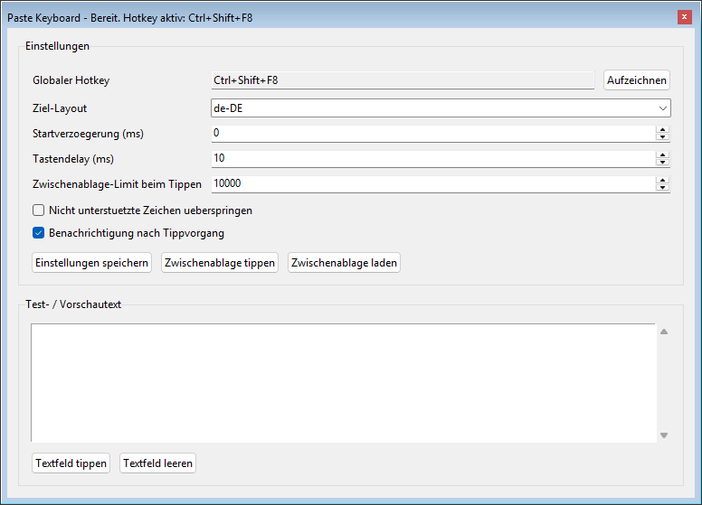

# Paste Keyboard

`Paste Keyboard` ist ein kleines Windows-Werkzeug, das Text aus der Zwischenablage als simulierte Tastendruecke eintippt. Das ist besonders nuetzlich fuer Browser-basierte VM-Konsolen wie Proxmox/noVNC, in denen normales Copy & Paste oft nicht zuverlaessig funktioniert.

English summary: `Paste Keyboard` is a small Windows tool that types clipboard text as simulated keystrokes. It is useful for browser-based VM consoles such as Proxmox/noVNC where normal copy and paste is unreliable.

## Kurzueberblick

- Windows-Desktop-App mit `tkinter`
- Oberflaeche auf Deutsch oder Englisch umschaltbar
- globaler Hotkey zum Ausloesen, per `Aufzeichnen` direkt ueber Tastendruck setzbar
- Ziel-Layout umschaltbar:
  - `de-DE`
  - `en-US`
  - `en-US-intl`
- einstellbare Startverzoegerung und Tippgeschwindigkeit
- Eingabe aus Zwischenablage oder aus dem Test-/Vorschautext
- `Zwischenablage tippen` akzeptiert nur Text; das Limit ist in der GUI konfigurierbar und standardmaessig `1000` Zeichen pro Ausloesung
- optionale Abschlussbenachrichtigung mit kleinem Popup unten rechts; Windows-Tray-Benachrichtigung wird zusaetzlich versucht
- es kann nur eine Instanz gleichzeitig laufen
- Einstellungen werden unter `%APPDATA%\\PasteKeyboard\\settings.json` gespeichert

## Schnellstart

```powershell
python main.py
```

Minimiert starten, z. B. fuer eine Windows-Autostart-Verknuepfung:

```powershell
python main.py --minimized
```

Mit `--minimized` startet die App direkt im Windows-Infobereich. Das Hauptfenster erscheint nicht als normaler Taskleisten-Button; geoeffnet und beendet wird die App ueber das Tray-Symbol.

Wenn bereits eine Instanz laeuft, startet keine zweite App-Instanz. Stattdessen erscheint ein kurzer Hinweis.

Bei der gebauten EXE:

```text
PasteKeyboard.exe --minimized
```

Autostart einrichten:

1. `Win+R` druecken.
2. `shell:startup` eingeben und bestaetigen.
3. Eine Verknuepfung zu `PasteKeyboard.exe` in diesen Ordner legen.
4. In den Eigenschaften der Verknuepfung unter `Ziel` den Parameter `--minimized` anhaengen, z. B.:

```text
"C:\Tools\PasteKeyboard\PasteKeyboard.exe" --minimized
```

Danach:

1. Optional `Sprache` / `Language` waehlen.
2. Ziel-Layout waehlen.
3. Optional Hotkey mit `Aufzeichnen` / `Record`, Startverzoegerung, Tastendelay, Zwischenablage-Limit und Benachrichtigung anpassen.
4. Text in die Zwischenablage kopieren.
5. Ziel in der VM-Konsole fokussieren.
6. Hotkey druecken oder `Zwischenablage tippen` / `Type clipboard` verwenden.

Hinweis:

- Es wird nur Text aus der Zwischenablage verarbeitet. Bilder, Dateien und andere Clipboard-Formate werden nicht unterstuetzt.
- Direktes Tippen aus der Zwischenablage ist standardmaessig auf `1000` Zeichen begrenzt; das Limit kann in der GUI angepasst werden.
- Fuer laengere Inhalte: zuerst `Zwischenablage laden`, dann im Vorschaufeld mit `Textfeld tippen` ausloesen.
- Wenn bereits eine Instanz laeuft, startet eine zweite Instanz nicht noch einmal.

## Screenshots




## Dokumentation

- [Endanwender-Anleitung fuer die EXE](docs/enduser.md)
- [End User Guide](docs/enduser.en.md)
- [Nutzung aus dem Quellcode](docs/usage.md)
- [Source Usage](docs/usage.en.md)
- [Windows-Build-Anleitung](docs/build.md)
- [Windows Build Guide](docs/build.en.md)

## Tests

```powershell
python -m unittest discover -s tests -v
```

## Build

```powershell
powershell -ExecutionPolicy Bypass -File .\scripts\build.ps1
```

Das erzeugt `dist\PasteKeyboard.exe`, `dist\PasteKeyboard-Anleitung.pdf` und `dist\PasteKeyboard-Guide.pdf`. Signiert wird nur, wenn ein Zertifikats-Thumbprint per `-Thumbprint` oder `CODESIGN_THUMBPRINT` bereitgestellt wird. Details stehen in [docs/build.md](docs/build.md).

## Hinweise

- Das ausgewaehlte Ziel-Layout muss zum tatsaechlichen Layout in der VM passen.
- `en-US` kann Umlaute und einige Sonderzeichen nicht nativ abbilden.
- Fuer englische VMs mit Umlauten ist `en-US-intl` oft die bessere Wahl.
- Die Zwischenablage wird nur als Text gelesen; nicht-textliche Inhalte werden abgewiesen.
- Unterstuetzt werden nur Zeichen, die im gewaehlten Layout direkt oder ueber unterstuetzte Dead-Keys abbildbar sind.
- `Enter` und `Tab` werden explizit unterstuetzt.
- Nicht garantiert sind z. B. Emoji, CJK-Zeichen und viele Unicode-Sonderzeichen.
- Wenn `Nicht unterstuetzte Zeichen ueberspringen` deaktiviert ist, bricht die Eingabe am ersten nicht abbildbaren Zeichen ab.
- Globaler Hotkey und simulierte Tasteneingabe sind Windows-spezifisch.
- Hotkey-Aufzeichnung uebernimmt nur Kombinationen mit mindestens einem Modifier, z. B. `Ctrl`, `Alt`, `Shift` oder `Win`.
